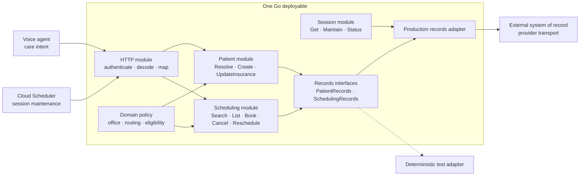
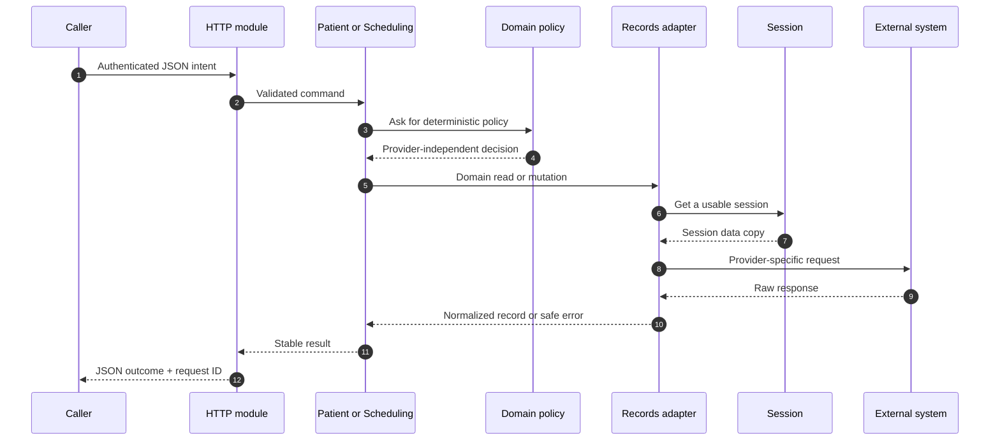
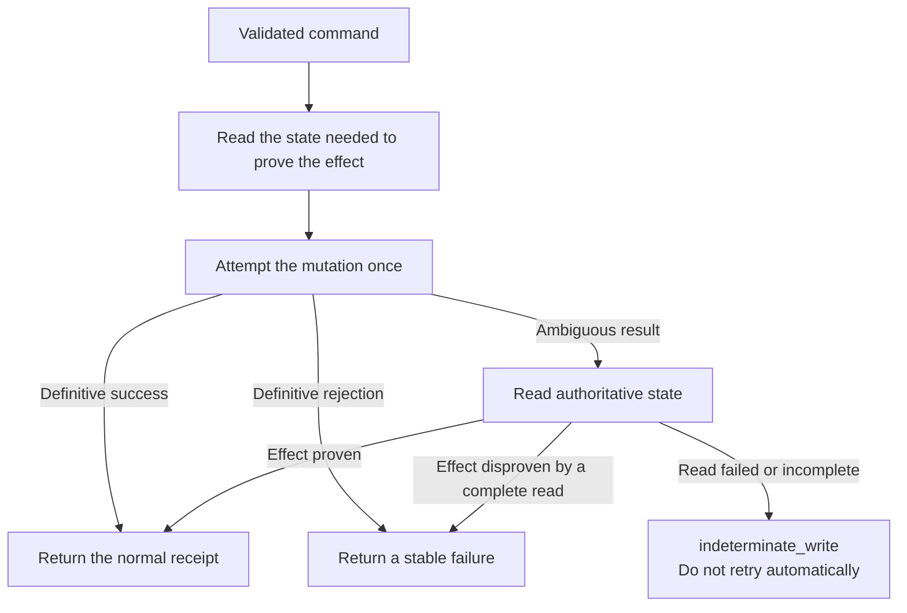
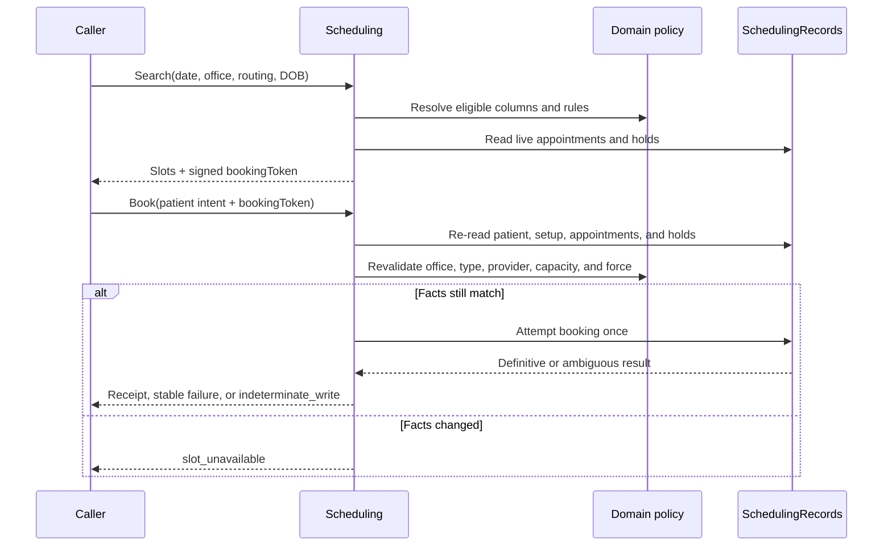
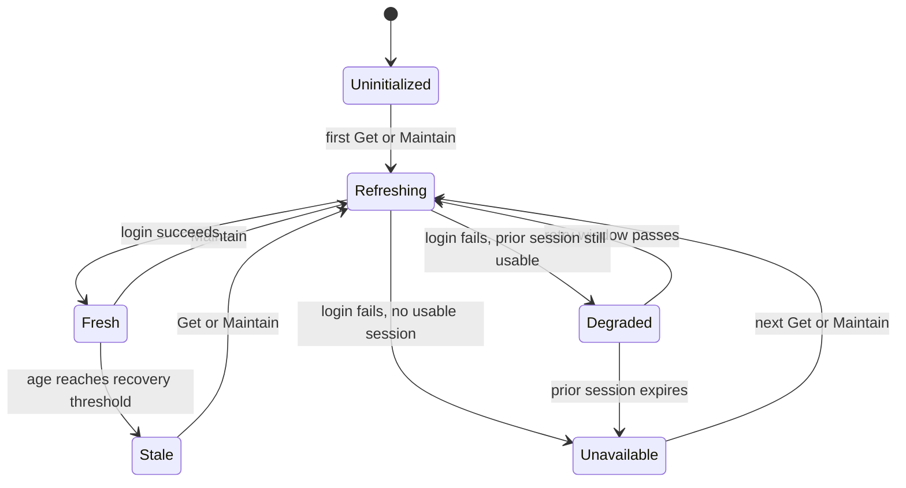

# Abita Middleware

**Safe patient and scheduling workflows between Acuity's voice agent and the
clinical system of record.**

The caller asks for outcomes—find this patient, offer a valid appointment,
book this slot, cancel this visit. The middleware owns everything required to
make those outcomes safe: authentication, office and insurance policy,
eligibility, concurrency checks, provider translation, and recovery when a
write may or may not have succeeded.

It is one Go deployable, organized as a modular monolith. Provider mechanics
stay at the edge; Acuity behavior stays at the center.

## Architecture in one minute

Read this diagram from left to right. The caller speaks in patient and
scheduling intent. Deep modules turn that intent into verified outcomes.
Provider-specific endpoints, payloads, and errors live behind the records seam.



The architectural rule is:

```text
caller intent → owned policy → verified effect
```

The external provider is an implementation detail, not the model the rest of
the codebase is built around.

## Design from first principles

The middleware exists because the two sides of the system should not need to
understand each other:

- The voice agent should not know credentials, provider endpoints, transport
  formats, office IDs, scheduler columns, or write-recovery rules.
- The clinical system should not need to understand conversational state,
  patient intent, routing language, or how a caller should recover.
- The middleware translates between them while preserving Acuity's rules.

Four principles shape the implementation:

1. **Intent enters; provider mechanics do not leak back.** Commands and results
   use Acuity language. Raw payloads stay in the production adapter.
2. **Every rule has one owner.** Patient behavior belongs to Patient,
   scheduling behavior belongs to Scheduling, and deterministic policy belongs
   to Domain.
3. **A write is not successful until its effect is known.** Ambiguous writes
   are reconciled through authoritative reads, never blindly repeated.
4. **Interfaces are the test surface.** Production and deterministic adapters
   cross the same seam used by the workflow modules.

## The modules

Each module exposes a small interface and hides a deeper implementation. That
gives callers leverage and keeps change local.

| Module | Interface callers learn | What the implementation owns |
| --- | --- | --- |
| HTTP | Authenticated JSON routes and stable response shapes | Authentication, request IDs, transport validation, and mapping |
| Patient | `Resolve`, `Create`, `UpdateInsurance` | Identity resolution, demographics, insurance policy, patient mutations, and reconciliation |
| Scheduling | `Search`, `List`, `Book`, `Cancel`, `Reschedule` | Availability, purpose-separated signed slots and cancellations, appointment intent, live revalidation, ownership checks, and reconciliation |
| Domain | Policy and domain values | Offices, routing, eligibility, appointment types, capacity, and time rules |
| Session | `Get`, `Maintain`, `Status` | Credentials, token lifecycle, single-flight login, and last-known-good state |
| AdvancedMD | `PatientRecords`, `SchedulingRecords` | The external-records seam, production adapter, stable errors, transport, parsing, and normalization |

`cmd/api/main.go` is the composition root. It creates one Session, one
production records adapter, one Patient module, one Scheduling module, and one
HTTP router. No workflow module creates its own production dependency.

## A request through the system



The HTTP module remains thin: it authenticates, validates transport shape, and
maps commands and results. It does not decide patient or scheduling policy.

## The invariants

These rules are more important than any individual endpoint:

- **One token owner.** Session is the only module that authenticates or mutates
  process-local session state.
- **One patient owner.** Patient owns complete resolution and patient mutation
  outcomes, including partial success.
- **One scheduling owner.** Scheduling owns availability, booking, and
  cancellation, and rescheduling as one coherent workflow.
- **One policy owner.** Domain owns office, routing, DOB, provider,
  appointment-type, and capacity decisions without performing I/O.
- **Complete reads prove absence.** A missing record from a partial read is
  unknown, not absent. Malformed occupancy fails its column read, and incomplete
  patient appointment reads return an appointment error rather than "none found".
- **Refresh is bounded.** Scheduler setup waits honor cancellation. Failed refreshes
  can reuse cached setup for at most 24 hours after its last successful load.
  Authentication failures respect the retry cooldown even without a usable token.
- **Ambiguous writes happen once.** The implementation reconciles through a
  read or returns `indeterminate_write`; callers must not retry automatically.
- **A slot is a signed promise.** Availability signs the selected policy facts,
  and booking revalidates them against current patient and schedule state.
- **Observability is PHI-safe.** Logs contain route, status, safe category,
  latency, and a redacted request ID—not bodies, patient IDs, tokens, or raw
  provider errors.

## Write safety

Network failure is not proof that a write failed. The provider may have applied
the mutation before the connection disappeared. Patient and Scheduling
therefore use the same recovery shape:



Examples of authoritative proof:

- Patient creation compares the pre-write patient baseline with exact
  post-write matches.
- Insurance replacement requires patient ID and DOB, loads fresh demographics,
  verifies DOB, and derives the current primary plan and responsible party.
  Legacy `insPlanId`, `respPartyId`, and `oldInsurance` inputs are ignored.
  A known empty current plan attaches directly; an already-matching active
  replacement performs no writes. Missing references block the operation.
- Booking reads the intended appointment month and matches the patient, office,
  time, provider, and appointment type.
- Cancellation reads the original appointment's owning month and proves
  whether it still exists.

Insurance update responses retain `status: updated|error` and diagnostic `outcome`,
and add `effect: no_effect|completed|partial|uncertain`. `no_effect` proves no
change from this request; `completed` proves the requested insurance is active;
`partial` means the old plan ended but the replacement was not attached;
`uncertain` means a possible effect could not be reconciled. Partial and uncertain
results require staff recovery, never an automatic repeat of end/add.

`POST /api/scheduler/slots` errors preserve the inventory envelope with `slots: []`.
`invalid_input` requires corrected input; `policy_blocked` requires resolving the
chart/office policy with staff. Neither retries the same search.
`availability_search_incomplete` is a read failure, permits one retry, and then
requires staff help; it never proves there are no openings.

Cancellation `provider_rejected` and `provider_conflict` are definitive failures,
not uncertain writes. Refresh appointments before a new action. Validation,
invalid-token, and ownership failures perform no cancellation. `write_failed`
means a pre-write failure or a reconciled failed write; `indeterminate_write`
means the cancellation may have happened and must not be retried automatically.
A `cancelled` receipt identifies the exact appointment that was cancelled.

## The scheduling handshake

Availability and booking are deliberately one workflow. A slot can become
invalid after it is offered, so booking never trusts an old search result by
itself.



This prevents a stale slot, changed patient context, or changed capacity
decision from silently becoming a booking.

## Session lifecycle

The process keeps one session in memory. `Get` performs request-time recovery;
`Maintain` supports authenticated proactive maintenance; `Status` reports
lifecycle state without exposing credentials, tokens, or provider URLs.



Concurrent callers share one in-flight login. A refresh failure may degrade the
session while a last-known-good token remains usable; an expired or missing
token makes the session unavailable.

## HTTP interface

All `/api/*` routes require `Authorization: Bearer <API_SECRET>`.

| Route | Intent |
| --- | --- |
| `POST /api/patient/resolve` | Resolve identity, demographics, routing, and upcoming appointments |
| `POST /api/add-patient` | Create a patient and attach primary insurance |
| `POST /api/patient/update-insurance` | Replace primary insurance |
| `POST /api/scheduler/availability` | Find policy-valid slots and sign them |
| `POST /api/appointment/book` | Revalidate and book a signed slot |
| `POST /api/appointment/cancel` | Verify ownership and cancel an appointment |
| `POST /api/appointment/reschedule` | Book a replacement, then cancel the confirmed original |

Each appointment returned by patient resolution may include a private,
short-lived `cancellationToken`. A cancellation request may send that token
with the legacy patient, appointment, and office fields; supplied legacy fields
must match the signed context. A valid token cancels without appointment
rediscovery. A supplied invalid token returns `invalid_cancellation_token`
without falling back or mutating the provider. Requests without the field keep
the legacy ownership-read path during the mixed-version rollout. The token is
an agent-to-middleware value and must not enter model prompts, speech, logs, or
analytics.

The structured request log adds a PHI-free `cancellation` object for this route
with path, semantic outcome, actual provider schedule-read count, cancellation
mutation count, and duration.

Operational routes have separate contracts:

| Route | Contract |
| --- | --- |
| `GET /health`, `GET /live` | Process liveness; no provider call |
| `GET /ready` | Local initialization readiness; no provider call |
| `GET /metrics` | PHI-free patient mutation counters |
| `POST /ops/session/maintenance` | Google-signed OIDC identity; never `API_SECRET` |

Agent-readable business failures intentionally remain JSON tool results, often
with HTTP 200 and `status: "error"`. Transport authentication failures use
HTTP 401, and maintenance failures use a redacted HTTP 503.
[Provider error diagnostics](internal/clients/diagnostics.go) preserve request correlation,
provider operation/status/code, and recovered failures without exposing payloads.

## Source map

```text
cmd/api/main.go                  composition root
internal/http/                   HTTP interface and transport mapping
internal/patient/                patient workflow
internal/scheduling/             availability, booking, cancellation, and rescheduling
internal/domain/                 pure policy and domain values
internal/session/                authentication and token lifecycle
internal/advancedmd/             records interfaces and production adapter
internal/advancedmd/advancedmdtest/   deterministic records adapter
internal/clients/                provider transport implementations
internal/safeerrors/             PHI-safe error classification
internal/config/                 runtime configuration
```

## Run locally

Requirements: Go 1.26+ and valid development credentials.

```bash
cp .env.example .env
set -a
source .env
set +a

go run ./cmd/api
```

The process listens on `0.0.0.0:$PORT` (`8080` by default).

```bash
curl http://localhost:8080/live
curl http://localhost:8080/ready
```

Build and verify:

```bash
go build ./...
go test ./...
go vet ./...
```

The container uses the same interface:

```bash
docker build -t abita-middleware:local .
docker run --rm --env-file .env -p 8080:8080 abita-middleware:local
```

`.env` is excluded from Git and the Docker build context. Never commit
credentials or bake them into an image.

## Runtime model

Production runs one Cloud Run instance because Session and the scheduler setup
cache are process-local. Authentication correctness does not depend on
background CPU: Cloud Scheduler requests maintenance, while `Get` retains
bounded request-time recovery.

Deployment configuration and verification live in the
[deployment script](scripts/deploy-cloud-run.sh) and
[staging verification](scripts/staging_deployment.py).

## Where the details live

The README explains the system. Detailed provider and policy data stay close to
their owners:

- [AdvancedMD adapter](internal/advancedmd/adapter.go) — provider records and completeness
- [Office policy](internal/domain/office.go) — offices, scheduler columns, and routing lanes
- [Insurance decisions](internal/domain/insurance_decision.go) — participation and scheduling requirements
- [Patient resolution](internal/patient/resolve.go) — identity and appointment loading
- [Deployment](scripts/deploy-cloud-run.sh) — production configuration and maintenance identity
- [Contributing](CONTRIBUTING.md) — pull request, merge, and release conventions

The executable source of truth is the owning module and its interface-level tests.

## First-name/DOB resolution

`POST /api/patient/resolve` accepts `firstName` + valid `dob` without surname.
Middleware owns exact first-name/DOB matching against the complete provider
candidate set. A unique match is checked against demographics and hydrated with
insurance and appointments. No match returns `not_found`; multiple exact matches
return `multiple_matches` for staff resolution. Incomplete retrieval or conflicting
identity returns `unresolved` rather than activating a patient.

The AdvancedMD seam retrieves `lookuppatient` with `@name: ",FirstName"` and
traverses provider pagination, validating page/count evidence. The Patient module
owns identity validation. See [first-name resolution](internal/patient/first_name.go)
and its tests for the matching contract.

### Rescheduling

Rescheduling uses the existing booking and cancellation paths in one middleware
command. It needs no additional infrastructure or deployment settings. The
caller sends it once and retains the returned receipt. A replacement is booked
before the original is cancelled. `partial` and `uncertain` receipts require
reconciliation and must not be presented as completed moves. See
[rescheduling](internal/scheduling/reschedule.go) and its tests.
