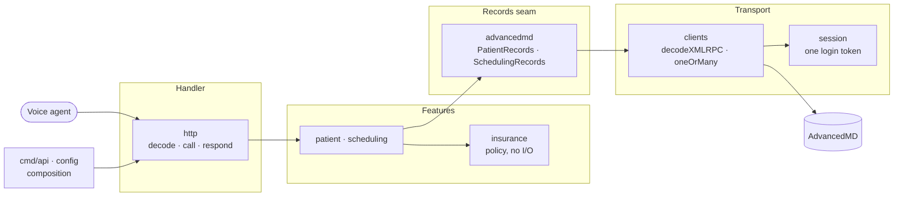
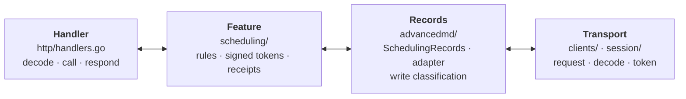
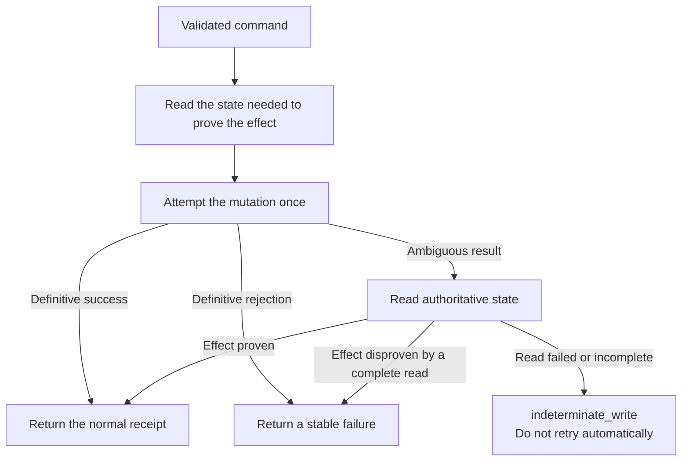
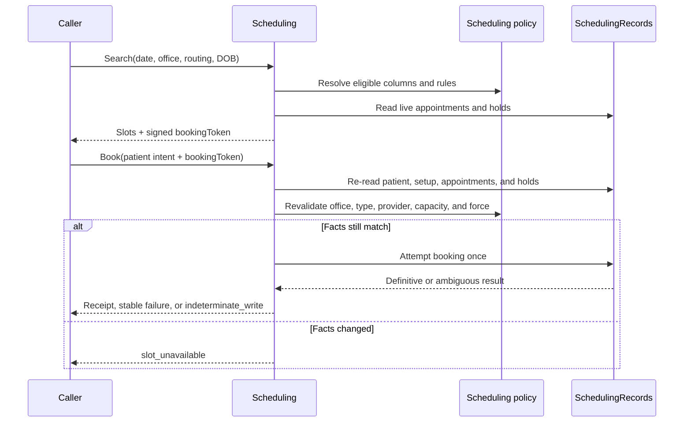
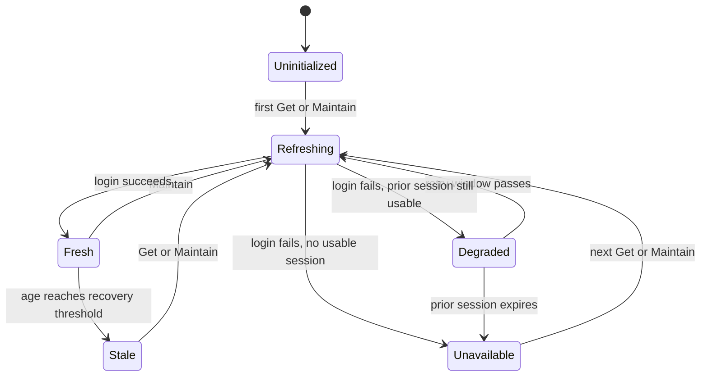

# Abita Middleware

**Safe patient and scheduling workflows between Acuity's voice agent and the
clinical system of record.**

The caller asks for outcomes: find this patient, offer a valid appointment, book this
slot, cancel this visit. The middleware owns everything that makes those outcomes safe:
authentication, office and insurance policy, concurrency checks, provider
translation, and recovery when a write may or may not have succeeded. It is one Go
deployable, organized as a modular monolith.

**Agent-friendly means a correct edit to one file preserves the whole service's
invariants.** The design below exists so that an edit in the right folder cannot break a
rule somewhere else.

## Six nouns organize the service

Each noun has one place in the tree and one job at runtime.

| Noun | Place | Job |
| --- | --- | --- |
| **Handler** | `internal/http/` | Decode one request, call one feature, respond. Records the PHI-safe request outcome. Never decides policy. |
| **Feature** | `internal/patient/`, `internal/scheduling/`, `internal/insurance/` | The one owner of a workflow's rules, receipts, and reconciliation. Commands and results carry their own JSON tags. |
| **Value** | `internal/domain/`, `internal/safeerrors/`, `internal/safelog/` | Shared offices, routing, patient and scheduler types, and PHI-safe errors and logs. No I/O. |
| **Records** | `internal/advancedmd/` | The `PatientRecords` and `SchedulingRecords` seam, the production adapter, the deterministic test adapter, and the one classifier of failed writes. |
| **Transport** | `internal/clients/`, `internal/session/` | AdvancedMD XMLRPC and REST calls, the one response decoder, and the one owner of the login token. |
| **Composition** | `cmd/api/`, `internal/config/` | Reads the environment once and wires one of everything. |

## Layers are visible in the tree

A package's folder tells you where it sits and which imports are legal.


```mermaid
flowchart LR
  agent(["Voice agent"]) --> http
  composition["cmd/api · config<br/>composition"] --> http
  subgraph handler["Handler"]
    http["http<br/>decode · call · respond"]
  end
  subgraph features["Features"]
    workflows["patient · scheduling"]
    insurance["insurance<br/>policy, no I/O"]
  end
  subgraph seam["Records seam"]
    records["advancedmd<br/>PatientRecords · SchedulingRecords"]
  end
  subgraph transport["Transport"]
    clients["clients<br/>decodeXMLRPC · oneOrMany"]
    session["session<br/>one login token"]
  end
  http --> workflows
  workflows --> insurance
  workflows --> records
  records --> clients
  clients --> session
  clients --> amd[("AdvancedMD")]
```

Every layer may use the values (`domain`, `safeerrors`, `safelog`), which import nothing
internal.

| Layer | Packages | May import |
| --- | --- | --- |
| Value | `domain`, `safeerrors`, `safelog` | nothing internal |
| Session | `session` | values |
| Transport | `clients` | values, session |
| Records | `advancedmd`, `advancedmdtest` | values, session, transport |
| Policy | `insurance` | values |
| Feature | `patient`, `scheduling` | values, records, policy. Never another feature. |
| Handler | `http` | values, session, records, policy, features. Never transport. |
| Composition | `cmd/api`, `config` | anything |

[layers_test.go](layers_test.go) assigns every package a layer and fails on an import that
points the wrong way. A new package fails the test until it is given a layer.

## Feature blueprint

A feature is a vertical slice. The request shape, the rules, the provider seam, and the
wire format each live in their named owner.


```mermaid
flowchart LR
  handler["<b>Handler</b><br/>http/handlers.go<br/>decode · call · respond"]
  feature["<b>Feature</b><br/>scheduling/<br/>rules · signed tokens · receipts"]
  records["<b>Records</b><br/>advancedmd/<br/>SchedulingRecords · adapter<br/>write classification"]
  transport["<b>Transport</b><br/>clients/ · session/<br/>request · decode · token"]
  handler <--> feature <--> records <--> transport
```

**The handler never handles provider calls, retries, reconciliation, or token state.**

To add a capability:

1. Put the rule in the feature that owns it. Give its command and result JSON tags so the
   handler can decode and encode them directly.
2. If it needs AdvancedMD data, add a method to `PatientRecords` or `SchedulingRecords`
   and implement it in [adapter.go](internal/advancedmd/adapter.go) and
   [advancedmdtest](internal/advancedmd/advancedmdtest/adapter.go).
3. Parse the provider response in `clients` with `decodeXMLRPC` and `oneOrMany`, and
   return domain types.
4. Add a handler that decodes (`decodeStrict` for new endpoints), calls the feature, and
   calls `respond`. Register the route in [router.go](internal/http/router.go).
5. Read any new environment variable in [config](internal/config/config.go) and wire the
   dependency in [main.go](cmd/api/main.go).

## Decisions

- **One writer per state.** `session` owns the login token, `patient` owns patient
  mutations, `scheduling` owns appointment writes and signed tokens, and
  `advancedmd.classifyMutation` alone decides whether a failed write is definite or
  ambiguous.
- **Writes are sent once.** An ambiguous write is reconciled through an authoritative
  read or returned as `indeterminate_write`, never retried automatically. See
  [Write safety](#write-safety).
- **Complete reads prove absence.** A record missing from a partial read is unknown, not
  absent. Malformed occupancy fails its column; an incomplete appointment read is an error,
  not "none found".
- **A slot is a signed promise.** Slot, cancellation, and reschedule tokens share one
  HMAC signer in [tokens.go](internal/scheduling/tokens.go). Booking revalidates the signed
  facts against live state. `TestTokenFormatIsStable` pins the token bytes so in-flight
  tokens survive a deploy.
- **Refresh is bounded.** Scheduler setup waits honor cancellation, and a failed refresh
  can reuse cached setup for at most 24 hours. Authentication failures respect the retry
  cooldown.
- **Config owns the environment.** Only [config](internal/config/config.go) reads
  environment variables.
- **Response shapes are a contract with the voice agent.** A change to a request or
  response shape ships together with the agent that reads it.
- **Observability is PHI-safe.** Logs carry route, status, safe category, latency, and a
  redacted request ID, never bodies, patient IDs, tokens, or raw provider errors.
- **No code comments.** Intent lives in names and types.
  [comments_test.go](comments_test.go) allows only `//go:` directives.

## Write safety

Network failure is not proof that a write failed. The provider may have applied
the mutation before the connection disappeared. Patient and Scheduling
therefore use the same recovery shape:


```mermaid
flowchart TD
    command["Validated command"] --> prepare["Read the state needed to prove the effect"]
    prepare --> write["Attempt the mutation once"]
    write -->|Definitive success| receipt["Return the normal receipt"]
    write -->|Definitive rejection| failure["Return a stable failure"]
    write -->|Ambiguous result| reconcile["Read authoritative state"]
    reconcile -->|Effect proven| receipt
    reconcile -->|Effect disproven by a complete read| failure
    reconcile -->|Read failed or incomplete| unknown["indeterminate_write<br/>Do not retry automatically"]
```

Examples of authoritative proof:

- Patient creation compares the pre-write patient baseline with exact
  post-write matches.
- Insurance replacement requires patient ID and DOB, loads fresh demographics,
  verifies DOB, and derives the current primary plan and responsible party.
  Legacy `insPlanId`, `respPartyId`, and `oldInsurance` inputs are ignored.
  A known empty current plan attaches directly; an already-matching active
  replacement performs no writes. Missing references block the operation.
- Booking reads the intended appointment month and matches the patient, office,
  time, provider, and appointment type.
- Cancellation reads the original appointment's owning month and proves
  whether it still exists.

Insurance update responses retain `status: updated|error` and diagnostic `outcome`,
and add `effect: no_effect|completed|partial|uncertain`. `no_effect` proves no
change from this request; `completed` proves the requested insurance is active;
`partial` means the old plan ended but the replacement was not attached;
`uncertain` means a possible effect could not be reconciled. Partial and uncertain
results require staff recovery, never an automatic repeat of end/add.

`POST /api/scheduler/slots` lists openings without requiring chart insurance
clearance. Office, visit type, age, and requested routing select providers;
routine vision defaults to optical routing. Booking verifies patient identity,
the signed slot, appointment policy, and live occupancy without re-triaging chart
insurance. Insurance acceptance remains part of registration and insurance updates.

`POST /api/scheduler/slots` errors preserve the inventory envelope with `slots: []`.
`invalid_input` requires corrected input and never retries the same search.
`availability_search_incomplete` is a read failure, permits one retry, and then
requires staff help; it never proves there are no openings.

Cancellation `provider_rejected` and `provider_conflict` are definitive failures,
not uncertain writes. Refresh appointments before a new action. Validation,
invalid-token, and ownership failures perform no cancellation. Legacy validation
responses may omit the wire outcome; consumers must treat an unclassified error
conservatively rather than infer no effect. `write_failed`
means a pre-write failure or a reconciled failed write; `indeterminate_write`
means the cancellation may have happened and must not be retried automatically.
A `cancelled` receipt identifies the exact appointment that was cancelled.

## Insurance plans

Plan data lives in [internal/insurance/data](internal/insurance/data), one folder per
source insurance list:

- `south_florida/` follows the Abita Eye Group Insurance List (2026-07-07) for
  Hollywood, Sweetwater and North Miami Beach Optical.
- `spring_hill_crystal_river/` follows the Abita Eye Group medical reference
  (2026-07-07, AMD directory verified 2026-09-17) and the Spring Hill routine vision list.

Each folder has a `plans.csv` that defines every plan once: a stable `id`, a
caller-facing `label`, a `coverage` (`medical` or `routine_vision`), its AdvancedMD
carrier, `self_pay`, and the `aliases` a caller might say, separated by `|`. Each
office table (`doctors.csv`, `spring_hill.csv`, `crystal_river.csv`) mirrors the
sheet: one row per plan the office's list includes and one `yes|no|pending` column per
doctor, then `requires` (`kind` or `kind:channel`, separated by `;`), `only_offices`,
the caller `notice`, and the sheet's `note`. `office_tables.json` says which offices
use which table, and `carriers.json` names the AdvancedMD carriers. The data is
validated when the service starts; invalid data stops the process.
A table's doctor columns must be exactly the doctors of its offices.

Two generated files in `internal/insurance/testdata` pin behavior: `plans.golden.tsv`
has each plan's outcome, carrier, requirements and allowed doctors (adult and child)
at every office, and `phrasings.golden.tsv` has the decision for common caller
phrasings. Every plan name is also tested to resolve to its own plan. After a data
change, run `go test ./internal/insurance -run Golden -update` and review the diff.
A test also fails when a note uses one of the sheet's known rule phrasings (staff
check, Dr. Bach only, referral, prior authorization, office limit) that the row
doesn't encode; it can't read every possible wording, so review new notes too.

The office registry decides which doctors can take a visit: medical uses the office's
`all_three` tier, routine vision its optical tier, and the pediatric rule applies. The
plan only filters those doctors. Any `yes` doctor means the plan is accepted
(`needs_staff_task` when the plan requires a prior authorization, a PCP referral, or
staff verification); otherwise any
`pending` doctor sends the call to staff; otherwise it is not accepted.

`POST /api/insurance/decision` takes whatever the caller said. An exact name wins.
Otherwise the matcher finds every plan the words could mean, tolerating small typos,
extra words, and fragments. If those plans all end the same way at this office, it
answers with the best one; if not, it asks `Which of these is on your card` with up to
four `options` (`planId`, `label`); with more possibilities it asks for the full plan
name. Only "Medicare" or "Medicaid" with no plan name asks for the full plan name;
other generic words alone, or no match for this visit type, ask for the card. Every decision for
a plan carries its `planId` and `carrierId`.

To answer that question, send the caller's words again with `offeredPlanIds` set to
the offered `planId`s. The middleware picks the offered plan the words name ("Medicare"
after the Aetna options is Aetna Medicare), asks again with the offered plans that still
fit when the words are vague, and decides the words as a new plan when they name none of
them. The voice agent never matches the answer itself.

`POST /api/add-patient` and `POST /api/patient/update-insurance` accept an optional
`insurancePlanId`. When it is sent, the decision is made for that plan in the office's
list and coverage and its carrier is written; the name is not matched again. Without
it, the name is decided as above.

## The scheduling handshake

Availability and booking are deliberately one workflow. A slot can become
invalid after it is offered, so booking never trusts an old search result by
itself.


```mermaid
sequenceDiagram
    participant C as Caller
    participant S as Scheduling
    participant D as Scheduling policy
    participant R as SchedulingRecords

    C->>S: Search(date, office, routing, DOB)
    S->>D: Resolve eligible columns and rules
    S->>R: Read live appointments and holds
    S-->>C: Slots + signed bookingToken
    C->>S: Book(patient intent + bookingToken)
    S->>R: Re-read patient, setup, appointments, and holds
    S->>D: Revalidate office, type, provider, capacity, and force
    alt Facts still match
        S->>R: Attempt booking once
        R-->>S: Definitive or ambiguous result
        S-->>C: Receipt, stable failure, or indeterminate_write
    else Facts changed
        S-->>C: slot_unavailable
    end
```

This prevents a stale slot, changed patient context, or changed capacity
decision from silently becoming a booking.

## Session lifecycle

The process keeps one session in memory. `Get` performs request-time recovery;
`Maintain` supports authenticated proactive maintenance; `Status` reports
lifecycle state without exposing credentials, tokens, or provider URLs.


```mermaid
stateDiagram-v2
    [*] --> Uninitialized
    Uninitialized --> Refreshing: first Get or Maintain
    Fresh --> Stale: age reaches recovery threshold
    Fresh --> Refreshing: Maintain
    Stale --> Refreshing: Get or Maintain
    Degraded --> Refreshing: retry window passes
    Refreshing --> Fresh: login succeeds
    Refreshing --> Degraded: login fails, prior session still usable
    Refreshing --> Unavailable: login fails, no usable session
    Degraded --> Unavailable: prior session expires
    Unavailable --> Refreshing: next Get or Maintain
```

Concurrent callers share one in-flight login. A refresh failure may degrade the
session while a last-known-good token remains usable; an expired or missing
token makes the session unavailable.

## HTTP interface

All `/api/*` routes require `Authorization: Bearer <API_SECRET>`.

| Route | Intent | Owner |
| --- | --- | --- |
| `POST /api/patient/resolve` | Resolve identity, demographics, chart insurance, and upcoming appointments | `patient.Resolve` |
| `POST /api/add-patient` | Create a patient and attach primary insurance | `patient.Create` |
| `POST /api/patient/update-insurance` | Replace primary insurance | `patient.UpdateInsurance` |
| `POST /api/insurance/decision` | Decide plan participation for an office | `insurance.DecideInsurance` |
| `GET /api/insurance/plans?office=&coverage=` | List an office's plans for one coverage with each plan's decision, carrier, sheet note, and other offices that accept it (read-only) | `insurance.ListPlans` |
| `POST /api/scheduler/availability` | Find policy-valid slots and sign them | `scheduling.Search` |
| `POST /api/scheduler/slots` | List openings as an inventory envelope | `scheduling.List` |
| `POST /api/appointment/book` | Revalidate and book a signed slot | `scheduling.Book` |
| `POST /api/appointment/cancel` | Verify ownership and cancel an appointment | `scheduling.Cancel` |
| `POST /api/appointment/reschedule` | Book a replacement, then cancel the confirmed original | `scheduling.Reschedule` |

Each appointment returned by patient resolution may include a private,
short-lived `cancellationToken`. A cancellation request may send that token
with the legacy patient, appointment, and office fields; supplied legacy fields
must match the signed context. A valid token cancels without appointment
rediscovery. A supplied invalid token returns `invalid_cancellation_token`
without falling back or mutating the provider. Requests without the field keep
the legacy ownership-read path during the mixed-version rollout. The token is
an agent-to-middleware value and must not enter model prompts, speech, logs, or
analytics.

The structured request log adds a PHI-free `cancellation` object for this route
with path, semantic outcome, actual provider schedule-read count, cancellation
mutation count, and duration.

Operational routes have separate contracts:

| Route | Contract |
| --- | --- |
| `GET /health`, `GET /live` | Process liveness; no provider call |
| `GET /ready` | Local initialization readiness; no provider call |
| `GET /metrics` | PHI-free patient mutation counters |
| `POST /ops/session/maintenance` | Google-signed OIDC identity; never `API_SECRET` |

Agent-readable business failures intentionally remain JSON tool results, often
with HTTP 200 and `status: "error"`. Transport authentication failures use
HTTP 401, and maintenance failures use a redacted HTTP 503.
[Provider error diagnostics](internal/clients/diagnostics.go) preserve request correlation,
provider operation/status/code, and recovered failures without exposing payloads.

## Run locally

Requirements: Go 1.27+ and valid development credentials.

```bash
cp .env.example .env
set -a
source .env
set +a

go run ./cmd/api
```

The process listens on `0.0.0.0:$PORT` (`8080` by default).

```bash
curl http://localhost:8080/live
curl http://localhost:8080/ready
```

Build and verify. `go test ./...` also runs the layer and no-comments checks.

```bash
go build ./...
go test ./...
go vet ./...
test -z "$(gofmt -l cmd internal .)"
```

The container uses the same interface:

```bash
docker build -t abita-middleware:local .
docker run --rm --env-file .env -p 8080:8080 abita-middleware:local
```

`.env` is excluded from Git and the Docker build context. Never commit
credentials or bake them into an image.

## Runtime model

Production runs one Cloud Run instance because Session and the scheduler setup
cache are process-local. Authentication correctness does not depend on
background CPU: Cloud Scheduler requests maintenance, while `Get` retains
bounded request-time recovery.

Deployment configuration and verification live in the
[deployment script](scripts/deploy-cloud-run.sh) and
[staging verification](scripts/staging_deployment.py).

## Where the details live

The README explains the system. Detailed provider and policy data stay close to
their owners:

- [Records seam](internal/advancedmd/advancedmd.go) and [adapter](internal/advancedmd/adapter.go): provider records, completeness, and write classification
- [AdvancedMD transport](internal/clients/advancedmd_xmlrpc.go): the response decoder and `oneOrMany`
- [Office policy](internal/domain/office.go): offices, scheduler columns, and routing lanes
- [Insurance decisions](internal/insurance/decision.go) and [plan lists](internal/insurance/data): participation, matching, and scheduling requirements
- [Scheduling policy](internal/scheduling/policy.go) and [tokens](internal/scheduling/tokens.go): booking rules and signed promises
- [Patient resolution](internal/patient/resolve.go): identity and appointment loading
- [Deployment](scripts/deploy-cloud-run.sh): production configuration and maintenance identity
- [Contributing](CONTRIBUTING.md): pull request, merge, and release conventions

The executable source of truth is the owning module and its interface-level tests.

## First-name/DOB resolution

`POST /api/patient/resolve` accepts `firstName` + valid `dob` without surname.
Middleware owns exact first-name/DOB matching against the complete provider
candidate set. A unique match is checked against demographics and hydrated with
insurance and appointments. No match returns `not_found`; multiple exact matches
return `multiple_matches` for staff resolution. Incomplete retrieval or conflicting
identity returns `unresolved` rather than activating a patient.

The AdvancedMD seam retrieves `lookuppatient` with `@name: ",FirstName"` and
traverses provider pagination, validating page/count evidence. The Patient module
owns identity validation. See [first-name resolution](internal/patient/first_name.go)
and its tests for the matching contract.

### Rescheduling

Rescheduling uses the existing booking and cancellation paths in one middleware
command. It needs no additional infrastructure or deployment settings. The
caller sends it once and retains the returned receipt. A replacement is booked
before the original is cancelled. `partial` and `uncertain` receipts require
reconciliation and must not be presented as completed moves. See
[rescheduling](internal/scheduling/reschedule.go) and its tests.

